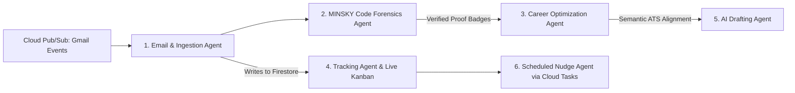

# ⚡ Signal: Autonomous Multi-Agent Career Workflow & Code Forensics

> **Problem**: Suppose you are a student ready for your career, but lost in the noise, unsure, overwhelmed by manual application tracking, and facing silent ATS resume rejections. **Signal** orchestrates your complete career workflow with deterministic proof-of-skill forensics and an autonomous multi-agent pipeline.

---

## 🎯 Architecture: 6-Agent LangGraph Pipeline

Signal replaces static resumes and chaotic application spreadsheets with a synchronized multi-agent pipeline:



### The 6 Agents

1. **Email & Ingestion Agent**
   - Connects to Gmail via Cloud Pub/Sub push topics.
   - Autonomously parses recruiter emails, interview invitations, stage updates, and interview dates/times.
   - **Write-path**: Updates application documents in Cloud Firestore with sub-second latency.

2. **MINSKY (GitProof Forensics Agent)**
   - Audits GitHub repositories using a dual-path verification strategy:
     - **Cryptographic Signatures**: Checks for GPG/SSH commit signatures where available (Yukawa potential term $\Phi$).
     - **Deterministic Physics-Based Fallback**: When signatures are absent (common for student developers), verifies proof-of-skill via commit frequency over time (Relativistic Momentum $p$ with Lorentz burst damping $1/\gamma$), file distribution (Inertial Mass $M$), Poisson arrival distribution (Boltzmann Entropy $S$), PR review history (Carnot Efficiency $\eta$), and Stokes fork drag.
   - Outputs deterministic, non-gameable proof scores (0–100) and verified badges.

3. **Career Optimization Agent**
   - Conducts semantic gap analysis between candidate's verified proof badges and target job descriptions.
   - Identifies matching strengths, missing technical requirements, and delivers tailored ATS optimization guidance.

4. **Tracking Agent**
   - Serves and renders the live real-time Kanban board across `Applied`, `Screening`, `Interview`, `Offer`, and `Rejected` stages.
   - Supports manual user drag-and-drop overrides and status management.

5. **AI Drafting Agent**
   - Generates personalized, evidence-backed cover letters, cold outreach messages, and follow-up templates referencing verified GitHub proof metrics.
   - Powered by Gemini 2.5 Flash / Gemini 3 Flash.

6. **Scheduled Nudge Agent**
   - Dispatches automated, time-sensitive follow-up reminders and interview preparation alerts.
   - Orchestrated via Google Cloud Tasks queues (`signal-interview-alerts`, `signal-recruiter-followup`).

---

## ☁️ Google Cloud Platform (GCP) Stack

| Component | Service | Role |
|---|---|---|
| **Agent Reasoning & Drafting** | **Gemini 2.5 Flash / Gemini 3 Flash** (Vertex AI) | High-speed multi-agent semantic analysis, parsing, and outreach generation |
| **Recruiter Ingestion** | **Cloud Pub/Sub** | Asynchronous ingestion stream for inbound Gmail webhook push events |
| **Live Kanban State** | **Cloud Firestore** | Sub-second near real-time document sync and forensic metadata storage |
| **Background Nudge Queues** | **Cloud Tasks** | Time-delayed queue execution for automated follow-up reminders |
| **Container Compute** | **Cloud Run** | Pay-per-use, scale-to-zero serverless container runtime (minimal idle cost) |
| **Auth & Security** | **Identity Platform + Cloud KMS** | Secure OAuth2 authentication and envelope encryption for sensitive resume & token data |

---

## 💻 Tech Stack

- **Frontend**: Next.js 16 (App Router), TypeScript, Tailwind CSS, Framer Motion, Lucide Icons, Sonner
- **Backend**: Python 3.11, FastAPI, LangGraph, Pydantic v2
- **AI / LLMs**: Google GenAI SDK (Gemini 2.5 Flash / Gemini 3 Flash), LangChain Google GenAI
- **Database & Auth**: Cloud Firestore / Supabase PostgreSQL (Row Level Security)

---

## 🚀 Quickstart & Local Setup

### 1. Clone the Repository
```bash
git clone https://github.com/Credo-Organization/credo2.git
cd credo2
```

### 2. Frontend Setup (Next.js)
```bash
# Install dependencies
npm install

# Configure environment
cp .env.example .env.local

# Start Next.js development server
npm run dev
```
Open [http://localhost:3000](http://localhost:3000) to access the landing page and navigate to `/dashboard/tracker` for the Multi-Agent Command Center.

### 3. Backend Setup (FastAPI + LangGraph)
```bash
cd backend

# Create and activate virtual environment
python3 -m venv .venv
source .venv/bin/activate  # On Windows: .venv\Scripts\activate

# Install requirements
pip install -r requirements.txt

# Start FastAPI server
uvicorn main:app --host 0.0.0.0 --port 8000 --reload
```
The API documentation is available at [http://localhost:8000/docs](http://localhost:8000/docs).

---

## 📡 Backend API Endpoints

- `POST /api/pipeline/run` — Executes the full 6-agent LangGraph workflow.
- `POST /api/email/ingest` — Ingestion Agent endpoint for Pub/Sub recruiter email payloads.
- `POST /api/minsky/audit` — MINSKY GitProof Code Forensics audit.
- `POST /api/optimize/gap-analysis` — Career Optimization semantic gap analyzer.
- `GET /api/kanban/state` — Tracking Agent Kanban board query.
- `POST /api/draft/outreach` — AI Drafting Agent outreach generator.
- `POST /api/nudge/schedule` — Scheduled Nudge Agent Cloud Tasks dispatcher.
