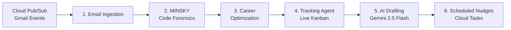

# ⚡ Signal — AI Job Application Tracker

> **The problem**: You're a student ready for your career but drowning in spreadsheets, facing silent ATS rejections, and getting ghosted after interviews. Signal fixes this with a 6-agent LangGraph pipeline that autonomously tracks applications, verifies your GitHub contributions, and drafts recruiter outreach — all powered by Gemini 2.5 Flash on GCP.

---

## Architecture: 6-Agent LangGraph Pipeline



| # | Agent | What it does |
|---|---|---|
| 1 | **Email & Ingestion Agent** | Connects to Gmail via Cloud Pub/Sub push. Parses recruiter emails, extracts interview dates, auto-updates Kanban stage in Cloud Firestore. |
| 2 | **MINSKY (GitProof)** | Dual-path GitHub forensics: GPG/SSH commit signature verification + metadata heuristics (commit cadence, PR review history, AST language analysis). Outputs deterministic proof scores 0–100. |
| 3 | **Career Optimization Agent** | Semantic gap analysis between your verified MINSKY badges and any job description. Delivers ATS keyword recommendations and match percentage. |
| 4 | **Tracking Agent** | Serves the live Kanban board (`Applied → Screening → Interview → Offer`) synced in near-real-time from Cloud Firestore. Supports manual drag-and-drop overrides. |
| 5 | **AI Drafting Agent** | Gemini 2.5 Flash generates evidence-backed cover letters and cold outreach messages using your verified GitHub proof metrics. |
| 6 | **Scheduled Nudge Agent** | Dispatches time-sensitive interview prep alerts and recruiter follow-ups via Google Cloud Tasks queues. |

---

## GCP Stack

| Service | Role |
|---|---|
| **Gemini 2.5 Flash** (Vertex AI) | Agent reasoning, email parsing, semantic analysis, and cover letter generation |
| **Cloud Pub/Sub** | Asynchronous Gmail webhook ingestion stream |
| **Cloud Firestore** | Sub-second Kanban board sync and forensic metadata store |
| **Cloud Tasks** | Queued background nudge dispatching (`signal-interview-alerts`, `signal-recruiter-followup`) |
| **Cloud Run** | Scale-to-zero serverless container runtime for the FastAPI backend |

---

## Tech Stack

- **Frontend**: Next.js 16, TypeScript, Tailwind CSS, Framer Motion
- **Backend**: Python 3.11, FastAPI, LangGraph, Pydantic v2
- **AI**: Google GenAI SDK, LangChain Google GenAI (Gemini 2.5 Flash)
- **Database**: Cloud Firestore, Supabase (auth + PostgreSQL)

---

## Quickstart

### 1. Clone

```bash
git clone https://github.com/uselessdevloper/signal-.git
cd signal-
```

### 2. Backend (FastAPI + LangGraph)

```bash
cd backend
python3 -m venv .venv
source .venv/bin/activate

pip install -r requirements.txt

cp .env.example .env
# Add your GOOGLE_API_KEY to .env

uvicorn main:app --host 0.0.0.0 --port 8000 --reload
```

API docs: [http://localhost:8000/docs](http://localhost:8000/docs)

### 3. Frontend (Next.js)

```bash
# From repo root
npm install
cp .env.example .env.local
# Fill in your Supabase keys in .env.local

npm run dev
```

Open [http://localhost:3000](http://localhost:3000). Navigate to `/dashboard/tracker` for the Multi-Agent Command Center.

### 4. Docker (Cloud Run ready)

```bash
cd backend
docker build -t signal-backend .
docker run -p 8000:8080 --env-file .env signal-backend
```

---

## API Endpoints

| Method | Path | Agent |
|---|---|---|
| `POST` | `/api/pipeline/run` | Full 6-agent LangGraph run |
| `POST` | `/api/email/ingest` | Agent 1 — Pub/Sub email parser |
| `POST` | `/api/minsky/audit` | Agent 2 — GitProof code forensics |
| `POST` | `/api/optimize/gap-analysis` | Agent 3 — Semantic gap analysis |
| `GET` | `/api/kanban/state` | Agent 4 — Live Kanban board |
| `POST` | `/api/draft/outreach` | Agent 5 — AI cover letter + cold email |
| `POST` | `/api/nudge/schedule` | Agent 6 — Cloud Tasks nudge scheduler |
