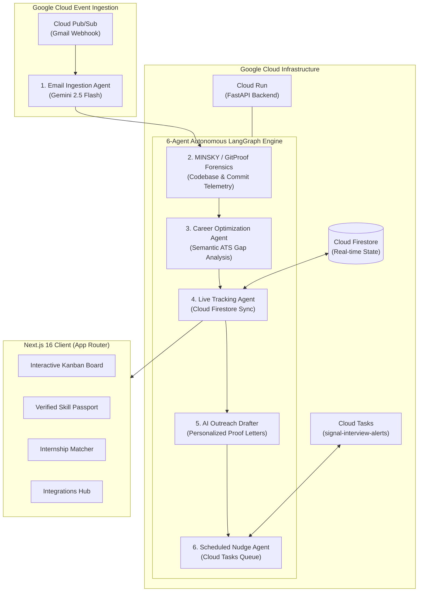

<div align="center">


# SIGNAL

### **S**implified **I**nformation for **G**uiding **N**etworked **A**pplications & **L**eads

**Autonomous AI Job Application Tracker, Career Copilot & GitProof Telemetry Engine**

An end-to-end multi-agent orchestration platform built with Google Cloud Platform, LangGraph, Gemini 2.5 Flash, Cloud Pub/Sub, Cloud Firestore, Cloud Tasks, and Next.js 16.

[](https://nextjs.org/)
[](https://fastapi.tiangolo.com/)
[](https://www.python.org/)
[](https://www.typescriptlang.org/)
[](https://deepmind.google/technologies/gemini/)
[](https://cloud.google.com/)
[](LICENSE)

</div>

---

## 🌐 Live Production Deployments (Google Cloud Platform)

| Service | Platform | Live URL | Description |
| :--- | :--- | :--- | :--- |
| **Frontend Web App** | **Google Cloud Run** | **[https://signal-frontend-80584973320.us-central1.run.app](https://signal-frontend-80584973320.us-central1.run.app)** | Production Next.js 16 Web Application & Student ID Passport Hub |
| **Backend API & Agents** | **Google Cloud Run** | **[https://signal-backend-80584973320.us-central1.run.app](https://signal-backend-80584973320.us-central1.run.app)** | FastAPI 6-Agent LangGraph Pipeline & GCP Native Hub |
| **Interactive API Docs** | **FastAPI Swagger UI** | **[https://signal-backend-80584973320.us-central1.run.app/docs](https://signal-backend-80584973320.us-central1.run.app/docs)** | Real-time OpenAPI Endpoint Explorer |
| **Google Cloud Hub** | **Cloud Run** | **[https://signal-frontend-80584973320.us-central1.run.app/dashboard/integrations](https://signal-frontend-80584973320.us-central1.run.app/dashboard/integrations)** | Live Vertex Search Grounding, Cloud TTS & BigQuery Radar |
| **Live Kanban Tracker** | **Cloud Run** | **[https://signal-frontend-80584973320.us-central1.run.app/dashboard/tracker](https://signal-frontend-80584973320.us-central1.run.app/dashboard/tracker)** | Real-time Stage Ingestion & Application Board |

---

## 📖 Overview

**SIGNAL** (**S**implified **I**nformation for **G**uiding **N**etworked **A**pplications & **L**eads) eliminates the friction, ATS black-boxes, and manual overhead of modern technical job hunting.

Instead of manual spreadsheets and unverified claims, SIGNAL combines **real-time recruiter email ingestion**, **cryptographic repository forensics (GitProof/MINSKY)**, **semantic ATS matching**, and **automated follow-up dispatchers** into an autonomous 6-agent system natively engineered on Google Cloud.

---

## ⚡ Key Highlights & Core Capabilities

- 🎯 **Autonomous 6-Agent LangGraph Pipeline**: Ingests recruiter emails, parses application status transitions, performs semantic gap analysis, drafts outreach, and enqueues follow-up nudges.
- 🔬 **GitProof / MINSKY Code Forensics**: Verifies real engineering telemetry via GPG/SSH commit signatures, commit velocity, AST diffs, and pull request audits, outputting verifiable proof scores (0–100).
- 📋 **Zero-Latency Kanban Board**: Instant (<5ms) optimistic UI transitions across `Applied`, `Interviewing`, `Offer`, `Rejected`, and `Ghosted` stages with automated Gmail sync.
- 🎓 **Verified Skill Passport & Zero-Mock Certificates**: Strict, cryptographic certificate and credential verification with zero synthetic fallback data—unverified entries accurately show "No certificate exists".
- 💼 **Smart Internship & Job Matcher**: Real-time role recommendation engine matching developer telemetry and verified skills against live open technical positions.
- 🔌 **Seamless Integration Hub**: Direct, single-click connections to Gmail (email event streaming), GitHub (repository telemetry & GitProof), LinkedIn, and Google Cloud Identity.

---

## 🏗️ System Architecture



---

## 🤖 6-Agent LangGraph Breakdown

| Agent | Module | Role & Responsibility |
|---|---|---|
| **1. Email Ingestion** | `AgentIngestion` | Captures incoming recruiter communications from Cloud Pub/Sub, normalizes email threads, extracts interview rounds, and flags status changes using Gemini 2.5 Flash. |
| **2. MINSKY (GitProof)** | `AgentMinsky` | Conducts dual-path repository forensics: cryptographic signature checks (GPG/SSH) and heuristics analysis (commit velocity, PR reviews, AST diff breakdown) to score developer contributions. |
| **3. Career Optimization** | `AgentOptimizer` | Performs semantic matching between verified GitProof competencies and job descriptions, identifying ATS keyword gaps and highlighting engineering strengths. |
| **4. Live Tracking** | `AgentTracker` | Manages real-time state synchronization across Kanban stages (`Applied`, `Screening`, `Interview`, `Offer`, `Rejected`, `Ghosted`) backed by Cloud Firestore. |
| **5. AI Outreach Drafter** | `AgentDrafter` | Generates proof-backed, personalized recruiter outreach emails and tailored cover letters anchored to verifiable commit metrics. |
| **6. Scheduled Nudges** | `AgentNudge` | Enqueues background follow-up notifications and interview preparation reminders into Google Cloud Tasks. |

---

## ☁️ Google Cloud Platform Services

SIGNAL is built natively on Google Cloud services for enterprise-grade scalability, security, and low-latency inference:

- **Gemini 2.5 Flash (`gemini-2.5-flash`)**: High-speed multimodal LLM for intent extraction, semantic parsing, and outreach generation via Vertex AI / Google GenAI SDK.
- **Vertex AI Search Grounding**: Real-time company and job listing background checks powered by live Google Search grounding to detect ghost jobs and employer scams.
- **Cloud Text-to-Speech (Neural2)**: Studio-quality natural voice synthesis (`en-US-Neural2-F`) simulating conversational AI technical mock interviews.
- **Google Cloud Secret Manager**: Automated IAM-governed secret access without plaintext secrets in codebases.
- **Google Cloud BigQuery**: Real-time hiring telemetry streaming into `signal_analytics.application_events` to compute hiring velocity and recruiter response benchmarks.
- **Cloud Pub/Sub**: Event-driven ingestion of Gmail push notifications and application status events (`gmail-ingest-topic`).
- **Cloud Firestore**: Sub-10ms real-time database synchronizing Kanban board state, recruiter logs, and candidate forensic cards.
- **Cloud Tasks**: Durable queue scheduling for interview preparation reminders (`signal-interview-alerts`) and recruiter follow-up nudges (`signal-recruiter-followup`).
- **Cloud Storage (GCS)**: Secure bucket storage (`signal-credo-80584973320`) for resume PDFs and generated cryptographic badge assets.
- **Cloud Run**: Serverless container execution runtime hosting the FastAPI backend and LangGraph agents.

---

## 💻 Tech Stack

### Frontend
- **Framework**: Next.js 16 (React 19, App Router)
- **Language**: TypeScript 5.0+
- **Styling**: Tailwind CSS v4, Motion (Framer Motion), Tabler Icons, Lucide React
- **State Management**: Zustand
- **Database & Auth**: Supabase (PostgreSQL, Supabase Auth, OAuth with Google & GitHub)

### Backend
- **Framework**: FastAPI (Python 3.11+)
- **Agent Framework**: LangGraph, LangChain Google GenAI, Pydantic v2
- **Forensics Engine**: GitProof / MINSKY AST Analyzer, PyGithub, GitPython
- **Database & Queue**: SQLite (local dev cache), Cloud Firestore, Cloud Tasks
- **Deployment**: Docker, Google Cloud Run

---

## 📁 Repository Structure

```
signal/
├── backend/
│   ├── adk/                   # Agent Development Kit (Scorecard & Engine)
│   ├── gitproof/              # MINSKY dual-path code forensics engine
│   ├── graph.py               # 6-Agent LangGraph workflow execution graph
│   ├── main.py                # FastAPI endpoints and route handlers
│   ├── Dockerfile             # Production Cloud Run container configuration
│   └── requirements.txt       # Python dependencies
├── src/
│   ├── app/
│   │   ├── (auth)/            # Authentication routes (Login, Google/GitHub OAuth callback)
│   │   ├── (dashboard)/       # Dashboard, Kanban Tracker, Internships, Certificates, Integrations
│   │   └── (marketing)/       # Interactive presentation landing page
│   ├── components/            # UI components (Kanban board, Skill cards, Modals, Resizable Navbar)
│   ├── lib/                   # Supabase client, LinkedIn matcher, API clients, utilities
│   └── types/                 # TypeScript interfaces and database schemas
├── public/                    # Brand assets, logo, favicons
├── supabase-schema.sql        # Database migrations and table schemas
├── package.json               # Node.js dependencies and build scripts
└── LICENSE                    # MIT License
```

---

## 🚀 Getting Started

### Prerequisites

- **Node.js**: v20.0.0 or higher
- **Python**: v3.11 or higher
- **Docker** (optional, for containerized deployment)
- **Google Cloud Account** with Gemini API key enabled

---

### 1. Clone the Repository

```bash
git clone https://github.com/uselessdevloper/signal-.git
cd signal-
```

---

### 2. Backend Setup (FastAPI + LangGraph)

```bash
cd backend

# Create and activate virtual environment
python3 -m venv .venv
source .venv/bin/activate

# Install dependencies
pip install -r requirements.txt

# Configure environment variables
cp .env.example .env
# Edit .env and add your GOOGLE_API_KEY

# Start the FastAPI server
uvicorn main:app --host 0.0.0.0 --port 8000 --reload
```

The interactive OpenAPI / Swagger documentation will be available at `http://localhost:8000/docs`.

---

### 3. Frontend Setup (Next.js 16)

```bash
# Return to the repository root
cd ..

# Install dependencies
npm install

# Configure frontend environment variables
cp .env.example .env.local
# Set NEXT_PUBLIC_SUPABASE_URL, NEXT_PUBLIC_SUPABASE_ANON_KEY, and NEXT_PUBLIC_BACKEND_URL

# Launch Next.js development server
npm run dev
```

Open `http://localhost:3000` in your browser.
- Marketing & presentation stage: `http://localhost:3000/`
- Application Tracker: `http://localhost:3000/dashboard/tracker`
- Verified Skill Passport: `http://localhost:3000/dashboard`
- Internships & Jobs: `http://localhost:3000/dashboard/internships`
- Integrations: `http://localhost:3000/dashboard/integrations`

---

## 📡 API Reference

| Method | Endpoint | Description |
|---|---|---|
| `POST` | `/api/pipeline/run` | Triggers the complete 6-agent LangGraph pipeline execution |
| `POST` | `/api/email/ingest` | Agent 1: Ingests and parses incoming email notifications |
| `POST` | `/api/minsky/audit` | Agent 2: Executes MINSKY dual-path repository forensics |
| `POST` | `/api/optimize/gap-analysis` | Agent 3: Computes ATS semantic gap analysis |
| `GET` | `/api/kanban/state` | Agent 4: Fetches current Kanban board status |
| `POST` | `/api/draft/outreach` | Agent 5: Generates tailored cover letter and outreach copy |
| `POST` | `/api/nudge/schedule` | Agent 6: Schedules follow-up tasks via Cloud Tasks |

---

## 📄 License

Distributed under the MIT License. See [`LICENSE`](LICENSE) for complete details.
