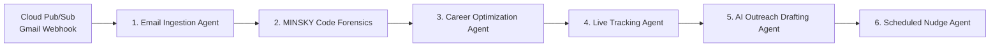

<div align="center">

# Signal

**Autonomous AI Job Application Tracker & Career Forensics Platform**

An end-to-end multi-agent orchestration pipeline powered by LangGraph, Gemini 2.5 Flash, Google Cloud Platform, and Next.js.

[](https://nextjs.org/)
[](https://fastapi.tiangolo.com/)
[](https://www.python.org/)
[](https://www.typescriptlang.org/)
[](https://deepmind.google/technologies/gemini/)
[](LICENSE)

</div>

---

## Overview

Signal resolves the core inefficiencies of modern technical job hunting: manual application tracking, unverified resume claims, ATS filtering, and missed follow-up deadlines. By leveraging a 6-agent LangGraph workflow running on Google Cloud Platform, Signal automates email parsing, performs dual-path code verification (MINSKY/GitProof), conducts semantic skill gap analysis, generates evidence-backed recruiter outreach, and dispatches automated interview alerts.

---

## Architecture

Signal is powered by a 6-agent autonomous pipeline built with LangGraph and FastAPI, interacting asynchronously with Google Cloud services and a Next.js 16 frontend.



### Agent Pipeline Breakdown

| Agent | Module | Description |
|---|---|---|
| 1. Email Ingestion | `AgentIngestion` | Captures recruiter communications via Cloud Pub/Sub webhooks, parses application status changes, and extracts interview dates. |
| 2. MINSKY (GitProof) | `AgentMinsky` | Conducts dual-path repository forensics: cryptographic signature verification (GPG/SSH) and heuristics analysis (commit velocity, PR reviews, AST breakdown) to output a 0-100 proof score. |
| 3. Career Optimization | `AgentOptimizer` | Performs semantic matching between verified MINSKY proof badges and target job descriptions, providing ATS keyword alignment score. |
| 4. Live Tracking | `AgentTracker` | Manages Kanban state synchronization across `Applied`, `Screening`, `Interview`, and `Offer` stages backed by Cloud Firestore. |
| 5. AI Outreach Drafting | `AgentDrafter` | Leverages Gemini 2.5 Flash to draft personalized, proof-backed cover letters and recruiter cold outreach based on verified code metrics. |
| 6. Scheduled Nudges | `AgentNudge` | Enqueues background notifications and follow-up alerts via Google Cloud Tasks queues. |

---

## Google Cloud Platform Integration

The system architecture utilizes managed Google Cloud services for high scalability and serverless performance:

- **Gemini 2.5 Flash (Vertex AI / Google GenAI SDK)**: Powers intent extraction, semantic gap analysis, structured parsing, and personalized text generation.
- **Cloud Pub/Sub**: Ingests real-time Gmail event webhooks asynchronously.
- **Cloud Firestore**: Provides real-time synchronization for Kanban board state and forensic store.
- **Cloud Tasks**: Handles scheduled queue dispatching for interview prep alerts (`signal-interview-alerts`) and recruiter follow-ups (`signal-recruiter-followup`).
- **Cloud Run**: Serverless container hosting environment for the FastAPI backend service.

---

## Tech Stack

### Frontend
- **Framework**: Next.js 16 (React 19, App Router)
- **Language**: TypeScript
- **Styling**: Tailwind CSS v4, Motion (Framer Motion), Tabler Icons, Lucide React
- **State Management**: Zustand
- **Database & Auth**: Supabase (PostgreSQL, Supabase Auth)

### Backend
- **Framework**: FastAPI (Python 3.11+)
- **Agent Framework**: LangGraph, LangChain Google GenAI, Pydantic v2
- **Database & Cache**: SQLite (GitProof local store), Cloud Firestore
- **Deployment**: Docker, Google Cloud Run

---

## Repository Structure

```
signal/
├── backend/
│   ├── gitproof/              # MINSKY dual-path code forensics engine
│   ├── graph.py               # 6-Agent LangGraph workflow execution graph
│   ├── main.py                # FastAPI endpoints and middleware
│   ├── Dockerfile             # Cloud Run container configuration
│   └── requirements.txt       # Python dependencies
├── src/
│   ├── app/                   # Next.js App Router (marketing, dashboard, public)
│   ├── components/            # UI components (Kanban tracker, analytics, widgets)
│   ├── lib/                   # Supabase client, utility functions, API connectors
│   └── types/                 # TypeScript interfaces and schema definitions
├── supabase-schema.sql        # Database migrations and table schemas
├── package.json               # Node.js dependencies and scripts
└── LICENSE                    # MIT License file
```

---

## Getting Started

### Prerequisites

- **Node.js**: v20.0.0 or higher
- **Python**: v3.11 or higher
- **Docker** (optional, for containerized execution)
- **Google Cloud Account** with Gemini API access

### 1. Repository Setup

```bash
git clone https://github.com/uselessdevloper/signal-.git
cd signal-
```

### 2. Backend Installation & Execution

```bash
cd backend

# Create virtual environment
python3 -m venv .venv
source .venv/bin/activate

# Install dependencies
pip install -r requirements.txt

# Environment configuration
cp .env.example .env
# Configure GOOGLE_API_KEY in .env

# Run FastAPI server
uvicorn main:app --host 0.0.0.0 --port 8000 --reload
```

The interactive OpenAPI documentation will be accessible at `http://localhost:8000/docs`.

### 3. Frontend Installation & Execution

```bash
# Return to repository root
cd ..

# Install dependencies
npm install

# Environment configuration
cp .env.example .env.local
# Configure Supabase and Backend API parameters in .env.local

# Run Next.js development server
npm run dev
```

Open `http://localhost:3000` in your browser. Navigate to `/dashboard/tracker` for the application tracking board.

### 4. Docker Deployment (Backend)

```bash
cd backend
docker build -t signal-backend .
docker run -p 8000:8080 --env-file .env signal-backend
```

---

## Environment Variables

### Frontend (`.env.local`)

| Variable | Description |
|---|---|
| `NEXT_PUBLIC_SUPABASE_URL` | Supabase API URL |
| `NEXT_PUBLIC_SUPABASE_ANON_KEY` | Supabase Anonymous Client Key |
| `SUPABASE_SERVICE_ROLE_KEY` | Supabase Administrative Service Key |
| `NEXT_PUBLIC_BACKEND_URL` | FastAPI Backend Endpoint (default: `http://localhost:8000`) |
| `GITHUB_CLIENT_ID` | GitHub OAuth Application Client ID |
| `GITHUB_CLIENT_SECRET` | GitHub OAuth Application Client Secret |

### Backend (`backend/.env`)

| Variable | Description |
|---|---|
| `GOOGLE_API_KEY` | Google Gemini API Key |
| `GITHUB_CLIENT_ID` | GitHub OAuth Client ID for verification API |
| `GITHUB_CLIENT_SECRET` | GitHub OAuth Client Secret for verification API |
| `SESSION_SECRET` | Secret key for local session encryption |

---

## API Reference

| Method | Endpoint | Description |
|---|---|---|
| `POST` | `/api/pipeline/run` | Triggers the complete 6-agent LangGraph pipeline execution |
| `POST` | `/api/email/ingest` | Agent 1: Ingests and parses incoming email notifications |
| `POST` | `/api/minsky/audit` | Agent 2: Executes MINSKY dual-path repository forensics |
| `POST` | `/api/optimize/gap-analysis` | Agent 3: Computes ATS semantic gap analysis |
| `GET` | `/api/kanban/state` | Agent 4: Fetches current Kanban board status |
| `POST` | `/api/draft/outreach` | Agent 5: Generates tailored cover letter and outreach copy |
| `POST` | `/api/nudge/schedule` | Agent 6: Schedules follow-up tasks via Cloud Tasks |

---

## License

Distributed under the MIT License. See [`LICENSE`](LICENSE) for complete license details and terms.
